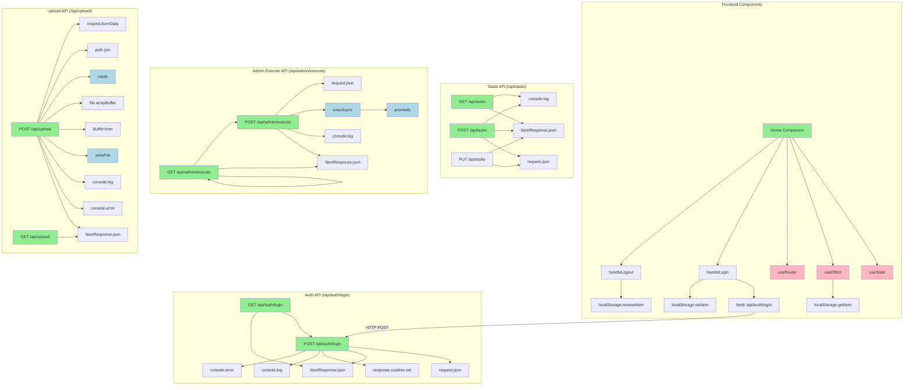

# Function Call Visualization - TaskMaster Pro

This diagram shows the relationships between functions and API endpoints in the codebase.

## How to View

- Copy the Mermaid code below into any Mermaid-compatible viewer
- Use GitHub (supports Mermaid in markdown files)
- Use online tools like mermaid.live
- VS Code with Mermaid preview extensions

## Color Legend

- 🟢 **Green**: Entry points (API routes and main components)
- 🔵 **Blue**: Utility functions
- 🌸 **Pink**: React hooks and lifecycle methods

## Function Call Graph

## Key Observations

### Main Execution Paths

1. **Authentication Flow**: `Home Component → handleLogin → fetch → POST /api/auth/login`
2. **Task Management**: Direct API calls to `/api/tasks` endpoints
3. **File Upload**: `POST /api/upload → formData → writeFile`
4. **Command Execution**: `POST /api/admin/execute → execAsync` (⚠️ Security Risk)

### Critical Security Concerns

- The admin execute endpoint allows arbitrary command execution
- GET endpoints that trigger POST actions (security anti-pattern)
- No authentication checks visible in the function flow
- Direct file system access without validation

### File References

- **Frontend**: `app/page.tsx:21-55` (handleLogin function)
- **Auth API**: `app/api/auth/login/route.ts:12-82` (POST handler)
- **Tasks API**: `app/api/tasks/route.ts:33-119` (GET/POST handlers)
- **Execute API**: `app/api/admin/execute/route.ts:7-126` (Command execution)
- **Upload API**: `app/api/upload/route.ts:5-94` (File upload handler)
